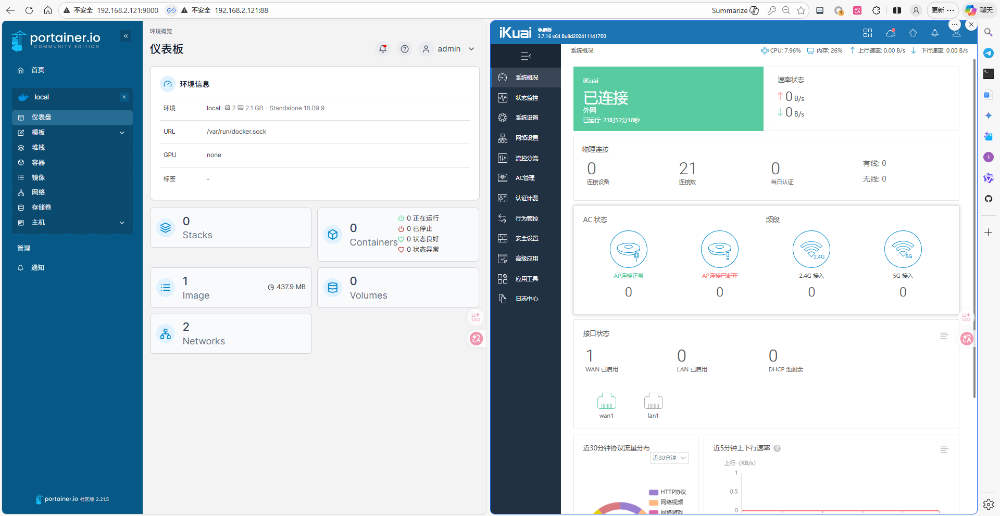

# iKuai 定制镜像 | 让你的软路由更简单

> 一键导入，省去繁琐配置

## 一、为什么要做这个镜像？

爱快（iKuai）是国内非常流行的软路由系统，功能强大、运行稳定，很多工作室、外贸公司甚至是我身边的大部分朋友都在用它。

我自己也一直在云服务器和本地使用爱快。但每次新开一台设备，都得重复一遍基础配置、安装 Docker 环境，费时费力。

为了解放生产力，我将常用的配置和 Docker 环境打包成了一个镜像，现在你只需要一键导入，就能拥有一个开箱即用的 iKuai 系统。

---

## 二、这个镜像定制了什么？

1.  **稳定为先**：基于官方 `3.7.16 x64` 版本制作，磁盘占用 8G。这个版本久经考验，资源占用低，对 IPv6 的支持也很好。
2.  **界面清爽**：隐藏了需要企业版才能使用的功能菜单，让界面更专注核心。
3.  **内置 Docker**：预先安装好 Docker 插件，无需再登录云平台手动下载。
4.  **图形化管理**：内置中文版 Portainer，这是一个强大的 Docker 容器 Web 管理界面，让你能更友好地从 `hub.docker.com` 拉取和管理镜像。

---

## 三、如何安装？

整个安装过程分为三步：**检查环境 -> 刷写镜像 -> 完成配置**。

### **步骤 1：检查服务器环境**

在动手之前，先摸清你的服务器“体质”。

#### **1.1 确认启动方式：BIOS 还是 UEFI？**

不同的云平台启动方式不同，需要下载对应的镜像包。

```bash
[ -d /sys/firmware/efi ] && echo "UEFI启动" || echo "传统BIOS启动"
```

*   **腾讯云**、**RackNerd** 等是 `传统BIOS启动`
*   **阿里云**、**甲骨文** 等是 `UEFI启动`

#### **1.2 确认磁盘设备名**

你需要找到系统盘的名称，比如 `vda`、`sda`。

```bash
# 查看所有磁盘和分区
lsblk

# 或者，直接看根目录挂载的是哪块盘
df -h / | awk 'NR==2 {print $1}'
```

**设备名小科普：**

| 设备前缀 | 常见接口类型 | 性能与场景 |
| :--- | :--- | :--- |
| **vda / vdb** | Virtio | **虚拟机专用**，性能最高。 |
| **sda / sdb** | SATA / SCSI | **最通用**，绝大部分云服务商默认。 |
| **hda / hdb** | IDE | **古董级**，兼容模式，性能较低。 |
| **nvme0n1** | NVMe | **高性能旗舰**，常见于 AWS 等。 |

#### **1.3 确认网卡**

执行下面命令，确认下网卡型号，心里有数。
```bash
lspci | grep -i ethernet
```

### **步骤 2：启动 Live 模式并刷写镜像**

这一步，我们会进入一个临时的“救援系统”来执行刷盘操作。

首先，下载并运行一键重装脚本，进入 Alpine Live 环境。

```bash
# 下载脚本 (二选一)
curl -O https://raw.githubusercontent.com/bin456789/reinstall/main/reinstall.sh
wget -O reinstall.sh https://raw.githubusercontent.com/bin456789/reinstall/main/reinstall.sh

# 执行脚本，进入 Live 模式
# 注意：执行后 SSH 会断开，需要重新连接
bash reinstall.sh alpine --hold=1
```

等待服务器重启完成后，**再次通过 SSH 登录**。

接下来，根据你第一步确认的启动方式，选择对应的命令开始刷盘。

#### **>>> 传统 BIOS 启动的设备**

*适用：腾讯云、kufanyun、racknerd 等*

```bash
# 下载 BIOS 版本的镜像包
wget https://github.com/ikuaiapp/ikuai-plus/releases/download/20260307/ikuai3.7.16_bios_x64.img.gz -O /tmp/ikuai.img.gz  

# 执行刷盘 (注意！of=/dev/vda 要换成你自己的设备名)
gzip -dc /tmp/ikuai.img.gz | dd of=/dev/vda bs=4M && sync
```

#### **>>> UEFI 启动的设备**

*适用：阿里云、甲骨文、saltyfish、rainyun 等*

```bash
# 下载 UEFI 版本的镜像包
wget https://github.com/ikuaiapp/ikuai-plus/releases/download/20260307/ikuai3.7.16_UEFI_x64.img.gz  

# 执行刷盘 (注意！of=/dev/sda 要换成你自己的设备名)
gzip -dc /tmp/ikuai.img.gz | dd of=/dev/sda bs=4M && sync
```

> **注意**：
> `dd` 命令是“毁灭级”操作，请再三确认 `of=` 后面的设备名是否正确！
> 目前在亚马逊 `nvme0n1` 磁盘上刷写暂未成功，请知悉。

刷写完成后，系统会自动重启，稍等片刻，全新的 iKuai 系统就诞生了。

---

## 四、安装之后

1.  **绑定网卡**：登录 云主机VNC 的后台,能看到`爱快中文控制台`，在 `1、设置网口绑定` -> `del lan1 ` 添加 `add wan1 eth0` 添加网卡。
2.  **开启web外部访问**： `o、其他选项` -> `2、开启外网访问web` 返回后，你就能使用网卡地址访问路由器管理界面
3.  **重新分区**（可选）：如果你需要更大的存储空间，系统也支持重新分区。分区脚本不会丢失，但分区后记得在 Docker 设置中重新挂载磁盘。

---
> **注意**：

> ikuai3.7.16_bios_x64.img.gz 爱快端口：88 和DockerUI 端口：9000 账号登陆：admin|china1234567

> ikuai3.7.16_uefi_x64.img.gz 爱快端口：88 和DockerUI 端口：9000 账号登陆：admin|china1234567

## 五、管理界面


1. 爱快管理用来管理分流
2. Portainer Docker管理界面用来配置各类功能，包括不局限于socks5、wireguard、vless、naive这些协议的IP

现在，开始享受你的高效软路由之旅吧！
