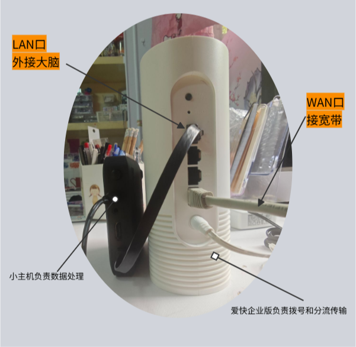
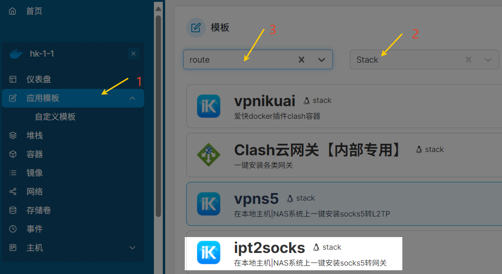
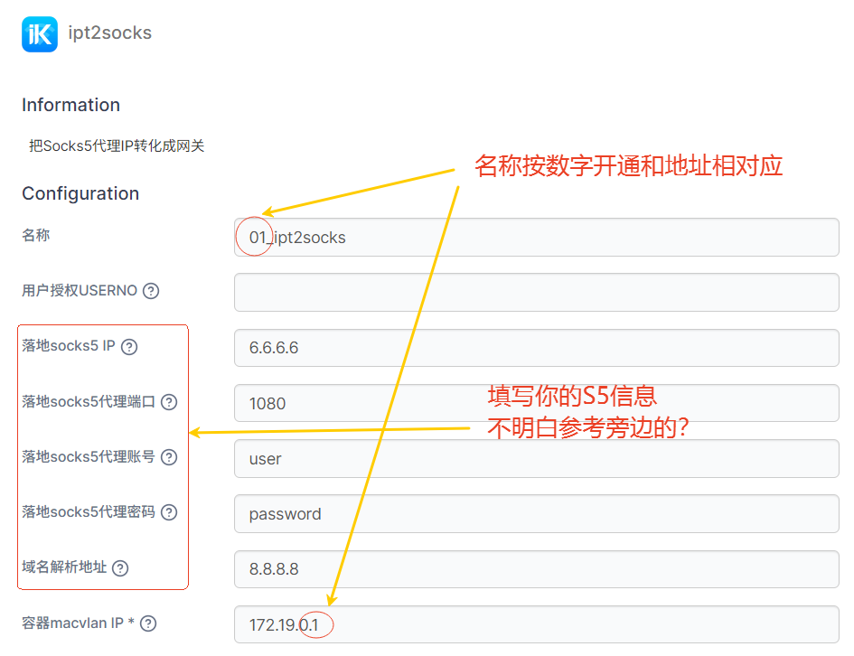
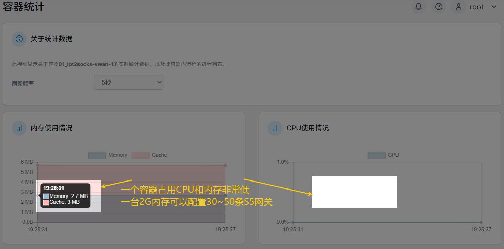
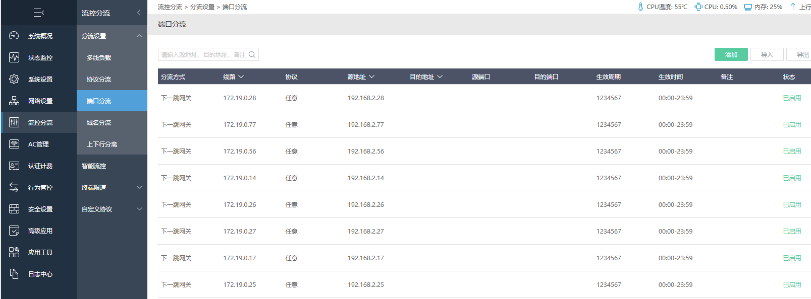
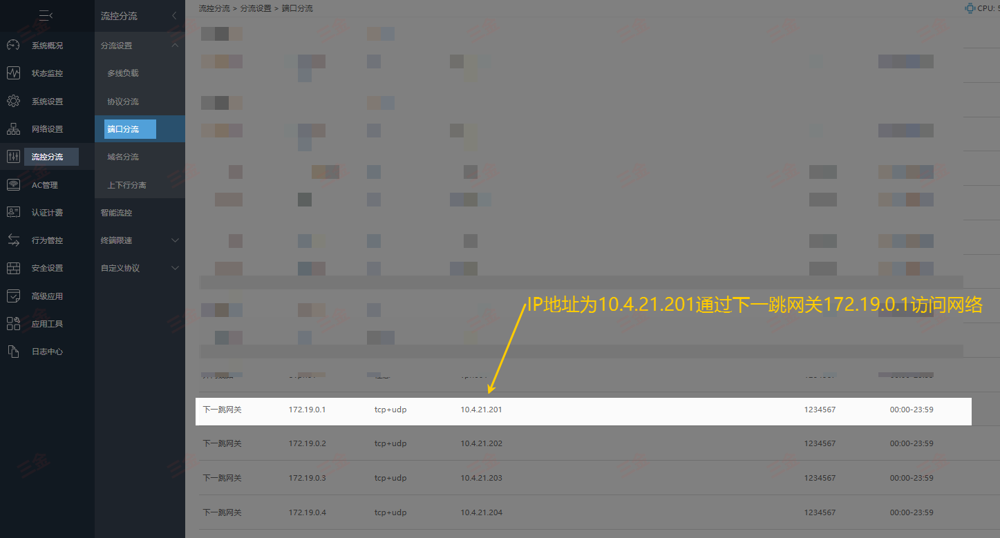

**标题：** 爱快路由的“超级大脑”：这套黑白配方案，专为外贸与TikTok直播而生

**前言：**

> 在全球化贸易的今天，网络不仅是连接世界的基础设施，更是外贸企业的核心“生产力”。一个稳定、高效、安全的网络环境，直接决定了您能否在激烈的市场竞争中抢占先机。
>
> 然而，许多企业在使用爱快 (iKuai) 路由时，常常陷入一个两难境地：爱快强大的拨号与流控能力毋庸置疑，但在应对复杂的加密数据转发或运行特定业务插件时，其自带的硬件算力往往会显得力不从心。
>
> 今天，我们将为您深度拆解一套行业领先的网络解决方案——“黑白配”爱快外挂大脑。这套方案不仅完美保留了爱快官方设备的稳定性，更通过外挂一个高性能的CPU“大脑”，彻底补齐了算力短板。无论您是需要为多个SSID配置独立海外IP、运营TikTok矩阵直播，还是管理游戏工作室以实现多账号防关联，这套方案都将是您的终极利器。

### **一、 核心架构：为什么需要一个“外挂大脑”？**

我们的“黑白配”方案，其精髓在于“分工协作”：

*   **爱快官方设备 (肢体):** 作为网络的基础，它稳定地负责拨号、DPI流量识别、AC无线管理以及强大的端口分流功能。
*   **外挂高性能CPU (大脑):** 作为一个独立的运算中心，它专门处理所有耗费算力的任务，如加密数据传输、Docker容器管理以及各种功能性插件。

**这套架构能为您带来什么核心优势？**

1.  **性能解耦，告别卡顿:** 加密运算不再占用主路由的CPU，彻底解决了因高负载导致的断网、重启等问题。您的直播将如丝般顺滑，不再掉线。
2.  **多SSID，多IP:** 结合ipt2socks透明网关技术，我们可以轻松实现“办公室A连接美国IP，直播间B连接英国IP”，而员工设备无需安装任何软件。
3.  **企业级稳定性:** 即使外挂的“大脑”设备出现任何波动，爱快主系统依然能保障基础网络的畅通，容错率极高。
4.  **灵活的IP选择:**
    *   **国内业务:** 可轻松购买和配置普通的家庭宽带IP。
    *   **海外业务 (如TikTok):** 可便捷地获取和使用原生的ISP家庭IP，满足平台要求。
    *   **高速专线:** 支持购买和配置IPLC等专线服务，实现高速跨国访问。

### **二、 如何选择硬件？**

根据您的业务规模和设备数量，我们提供了以下推荐配置清单，以实现最佳性价比：

| **玩家类型** | **终端规模** | **推荐硬件方案** | **预估成本** |
| :--- | :--- | :--- | :--- |
| **迷你个人玩家** | < 50 台 | Q3000 + 2G 内存小主机 | 约 500 元 |
| **小型工作室** | 50-100 台 | Q3000 + 4G 内存小主机 | 约 800 元 |
| **中型工作室** | 100-500 台 | Q6000 + 8G 内存小主机 | 约 1200 元 |
| **大型工作室** | > 500 台 | Q6000 + 16G 内存小主机 | 约 1700 元 |

### **三、 部署细节全解析**

**1. 硬件准备与系统优化**

*   **底层系统:** 为外挂的“小黑盒”刷入Armbian系统，这是一个轻量级的Linux发行版，可以最大限度地节省系统资源。
*   **管理地址:**
    *   爱快后台: `192.168.100.254:80`
    *   小黑盒 (Portainer管理界面): `192.168.100.x:9000`

**2. “大脑”环境构建 (Docker篇)**

在Armbian系统中，我们利用Docker来构建和管理我们的服务：

*   **核心镜像:** 安装`ipt2socks`镜像，它能将Socks5代理转化为透明网关，这是实现无感知代理的关键。
*   **权限分明:** 所有的IP地址和代理规则都在容器内部进行配置，客户端设备无需进行任何更改。

### **四、 核心：爱快端的分流配置**

这是实现“不同WiFi走不同IP”最核心的一步，我们主要利用爱快的 **端口分流（下一跳网关）** 功能。

**第一步：划分VLAN与SSID**

在爱快后台，为不同的业务组创建独立的VLAN接口：

1.  例如，创建`VLAN10`对应WiFi名 "TikTok_US"，`VLAN20`对应WiFi名 "TikTok_UK"。
2.  为`VLAN10`配置相应的DHCP服务，确保连接不同WiFi的设备能自动获取到不同的内网IP段。

**第二步：配置“下一跳”网关**

进入爱快的【流控分流】->【端口分流】菜单：

1.  **数据源:** 选择您刚刚创建的VLAN线路，或是指定的内网IP段（例如，只让直播专用手机走这条规则）。
2.  **执行动作:** 选择【下一跳】。
3.  **网关地址:** 填写“小黑盒”中对应容器运行的IP地址 (例如 `172.19.0.1`)。

### **五、 实战场景：TikTok矩阵直播**

对于运营TikTok矩阵的外贸直播间，这套方案完美地解决了最棘手的“**网络防关联**”问题：

*   **多SSID方案:** 爱快的AP默认支持创建8个不同的SSID。您只需在“大脑”中开启相应数量的代理通道，即可为每个SSID分配一个独立的海外IP。
*   **即连即用:** 员工的手机只需连接到指定区域的WiFi（如 "TikTok_US"），即可自动获得一个美国原生的ISP家庭IP，无需任何额外设置。
*   **安全可控:** 您可以在Portainer中为普通员工配置一个低权限的管理账号，并关闭所有高危端口，以确保企业内网的安全。

---

### **六、 方案总结**

| **维度** | **普通路由器** | **爱快 + 外挂CPU方案** |
| :--- | :--- | :--- |
| **稳定性** | 高负载时容易重启或卡顿 | **✅ 算力分离，可长期稳定运行不掉线** |
| **外贸适配性**| 难以实现精准、灵活的分流 | **✅ 支持多SSID对应独立IP，完美适配TikTok** |
| **扩展性** | 功能相对固定 | **✅ 支持Docker插件，可灵活扩展多种协议与功能** |

**结语：**

> 感谢您的耐心阅读。在当今的外贸领域，网络环境的“硬核”程度，直接决定了业务的效率和上限。
>
> 这套基于爱快官方WiFi路由器与Armbian“外挂大脑”的解决方案，绝非简单的技术堆叠，而是对生产力的深度释放。如果您希望了解更多细节或需要定制化的部署方案，请随时私聊我们。
